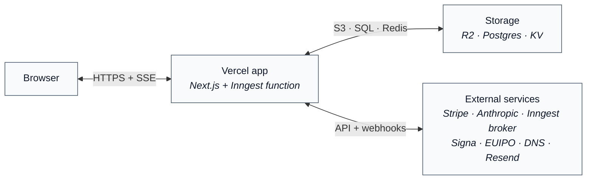
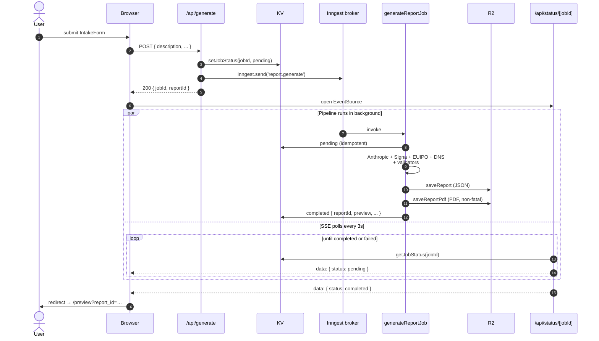
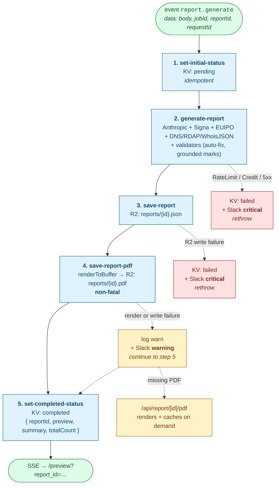
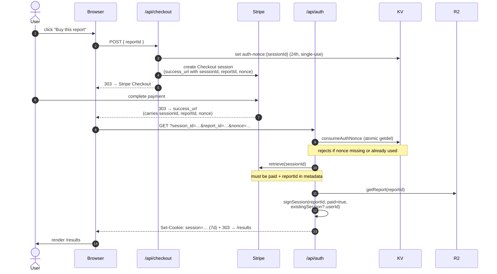
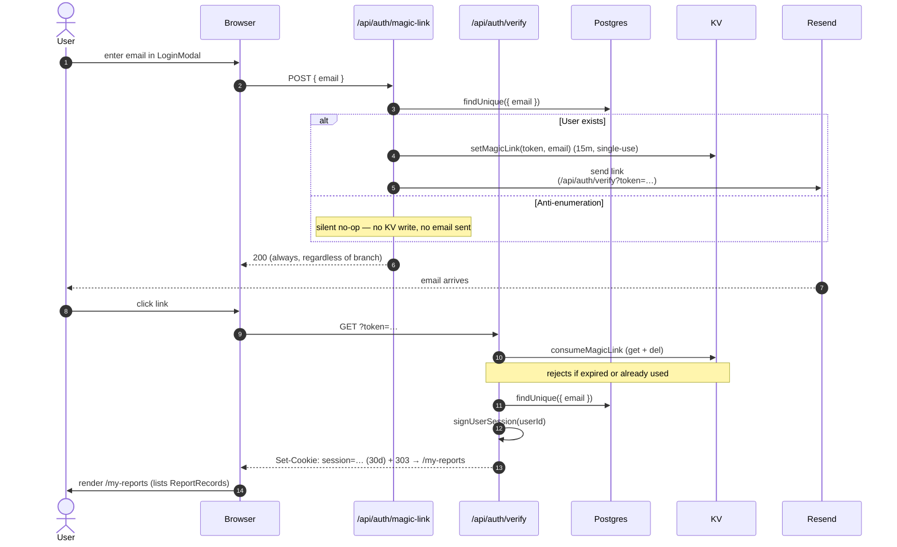

# Namewright — Solution Architecture

**Status:** Pre-launch (Phase 1 shipped)
**Last updated:** 2026-04-26
**Source of truth for:** system topology, request lifecycle, integration map, failure modes, deployment

This doc is descriptive (the system as it exists today). For _what_ we're building and _why_, see `docs/PRD.md`. For sequencing of upcoming work, see `docs/ROADMAP.md`. For coding conventions, see `CLAUDE.md` and `AGENTS.md`. For Anthropic-pipeline mechanics, see `docs/superpowers/specs/2026-04-22-agent-pipeline-design.md`.

---

## TL;DR

Namewright is a **dispatcher → broker → step-pipeline** application. `/api/generate` validates input, mints `jobId` + `reportId`, dispatches a `report.generate` event to **Inngest**, and returns immediately. Inngest invokes `generateReportJob` (`src/inngest/functions.tsx`), which runs five durable, individually-observable steps: claim status → run the LLM + trademark + domain pipeline → persist JSON to R2 → render and persist PDF to R2 → mark completed. The browser polls `/api/status/[jobId]` (SSE) until the job lands, then takes the user through preview → Stripe → `/results`.

Three storage systems with **non-overlapping** roles: **R2** holds the canonical reports (JSON + PDF, permanent), **Postgres** holds the user / report identity layer (multi-report sign-in via magic link), **KV** holds short-lived state only (job status, single-use auth nonces, magic-link tokens). KV is no longer canonical for report data.

**Where to start reading code:** `src/app/api/generate/route.ts` for the dispatcher, `src/inngest/functions.tsx` for the pipeline orchestration, `src/lib/anthropic.ts` for the synthesis pipeline, `src/lib/r2.ts` for storage, `src/app/api/status/[jobId]/route.ts` for the status stream.

---

## 1. System overview

Namewright runs an event-driven generation pipeline. `/api/generate` is now a thin
dispatcher that hands off to Inngest; the heavy work runs in a background job and
the browser polls a Server-Sent Events status stream until the report is ready.

**Context — what talks to what.** The 30-second model.

**Generate flow — what happens after the user clicks "Generate".** Time runs top-to-bottom.

**After preview**, the user goes through Stripe Checkout. The post-checkout `success_url` lands at `/api/auth`, which verifies the paid session, consumes a single-use KV nonce, sets the JWT cookie, and redirects to `/results`. A parallel `/api/webhook` receives the Stripe event server-side and upserts `User` + `ReportRecord` rows in Postgres for the multi-report identity layer (signed-in users use the magic-link flow at `/api/auth/magic-link` → `/api/auth/verify` to view their full report history at `/my-reports`). PDF download goes through `/api/report/[id]/pdf` with the same ownership gate.

The Inngest broker is hosted by Inngest in production (signed via
`INNGEST_SIGNING_KEY`) and runs locally in dev mode (`INNGEST_DEV=1`,
dashboard at <http://localhost:8288>). The handler at `POST/GET/PUT
/api/inngest` registers `generateReportJob` from `src/inngest/functions.tsx`
with `retries: 0`.

## 2. Request lifecycle (happy path)

| Step          | Surface                      | What happens                                                                                                                                                                                                                                                                                                                                               |
| ------------- | ---------------------------- | ---------------------------------------------------------------------------------------------------------------------------------------------------------------------------------------------------------------------------------------------------------------------------------------------------------------------------------------------------------- |
| 1             | Browser                      | User fills `IntakeForm.tsx` (description, personality, geography, constraints, TLDs, nameType) and submits                                                                                                                                                                                                                                                 |
| 2             | `proxy.ts`                   | Per-IP rate limit on `/api/generate`                                                                                                                                                                                                                                                                                                                       |
| 3             | `/api/generate`              | Validates input against allowlists from `types.ts` (`PERSONALITY_VALUES`, `GEOGRAPHY_VALUES`, `NAME_TYPE_VALUES`, `SUPPORTED_TLDS`); generates `jobId` + `reportId`                                                                                                                                                                                        |
| 4             | `/api/generate`              | `setJobStatus(jobId, { status: 'pending' })` in KV; `inngest.send({ name: 'report.generate', data: { body, jobId, reportId, requestId, mockPipeline } })`; returns 200 with `{ jobId, reportId }`                                                                                                                                                          |
| 5             | Browser                      | `IntakeForm.tsx` opens `EventSource('/api/status/${jobId}')` and waits                                                                                                                                                                                                                                                                                     |
| 6             | Inngest broker               | Picks up `report.generate`, invokes `generateReportJob` (`src/inngest/functions.tsx`)                                                                                                                                                                                                                                                                      |
| 7             | step `set-initial-status`    | Re-asserts `pending` in KV (idempotent — also covers retries, even though the function uses `retries: 0`)                                                                                                                                                                                                                                                  |
| 8             | step `generate-report`       | Pipeline in `lib/anthropic.ts`: `inferNiceClass` + `generateCandidates` (with homoglyph retry) → `checkAllTrademarks` (Signa) + `checkAllEuipoTrademarks` (LD flag + EU/Global geo) + `checkAllDomains` (DNS + RDAP + WhoisJSON, `Promise.allSettled`) → `synthesiseReport` → `validateReportData` + `validateGroundedMarks` + `validateStyleDistribution` |
| 9             | step `save-report`           | `saveReport(reportId, data)` writes `reports/${id}.json` to R2                                                                                                                                                                                                                                                                                             |
| 10            | step `save-report-pdf`       | Renders `ReportPdfDocument` via `renderToBuffer`, writes `reports/${id}.pdf` to R2. **Non-fatal** — failure is logged, paged, but does not fail the job; PDF route renders on demand                                                                                                                                                                       |
| 11            | step `set-completed-status`  | `setJobStatus(jobId, { status: 'completed', reportId, preview, summary, totalCount })`                                                                                                                                                                                                                                                                     |
| 12            | `/api/status/[jobId]`        | SSE polls `getJobStatus(jobId)` every 3s, streams the payload, closes on `completed` or `failed`                                                                                                                                                                                                                                                           |
| 13            | Browser                      | On `completed`, stashes preview/summary in `sessionStorage` and `router.push('/preview?report_id=...')`                                                                                                                                                                                                                                                    |
| 14            | `/preview`                   | Renders `FreePreview.tsx` (3 of N candidates) and the Stripe paywall CTA                                                                                                                                                                                                                                                                                   |
| 15            | `/api/checkout`              | Creates Stripe Checkout session with `success_url` carrying `{session_id, report_id, nonce}`; nonce stored in KV with short TTL                                                                                                                                                                                                                            |
| 16            | Stripe                       | User pays; redirects to `success_url`                                                                                                                                                                                                                                                                                                                      |
| 17            | `/api/auth`                  | `consumeAuthNonce` (atomic `kv.getdel`) + `stripe.checkout.sessions.retrieve` + `getReport` from R2; sets HttpOnly JWT cookie via `signSession(reportId, true, existingUserId?)` (jose, HS256, 7d); redirects to `/results?report_id=...`                                                                                                                  |
| 18            | `/results`                   | Reads JWT cookie → if `userId`, verify ownership via Prisma `ReportRecord`; else `session.reportId === reportId` → `getReport` from R2 → renders `FullReport.tsx`; offers PDF + email                                                                                                                                                                      |
| 19 (parallel) | `/api/webhook`               | Stripe webhook fires asynchronously; verifies signature; **does not set cookies** (server-side, not browser); dispatches email-me-a-copy via Resend if requested at paywall; upserts `User` + `ReportRecord` rows in Postgres                                                                                                                              |
| 20 (daily)    | `/api/cron/stripe-reconcile` | Detects paid Stripe sessions missing from storage (webhook-never-arrived failure mode); alerts Slack                                                                                                                                                                                                                                                       |

### 2a. Magic-link sign-in (multi-report users)

| Step | Surface                                 | What happens                                                                                                                                                                                             |
| ---- | --------------------------------------- | -------------------------------------------------------------------------------------------------------------------------------------------------------------------------------------------------------- |
| M1   | `LoginModal.tsx`                        | User enters email                                                                                                                                                                                        |
| M2   | `/api/auth/magic-link`                  | If a Postgres `User` with that email exists, generate a 15-min token, `setMagicLink(token, email)` in KV, send email via Resend. **Always returns 200** even when the user is unknown (anti-enumeration) |
| M3   | Email link → `/api/auth/verify?token=…` | `consumeMagicLink(token)` (single-use; deleted on read), look up `User` in Postgres, sign a 30-day cookie via `signUserSession(userId)`, redirect to `/my-reports`                                       |
| M4   | `/my-reports`                           | Lists every `ReportRecord` for this `userId`. Each row links to `/results?report_id=…` (the same Stripe-redirect cookie path also recognises `userId` ownership)                                         |
| M5   | `/api/auth/logout`                      | Deletes the `session` cookie                                                                                                                                                                             |

## 3. Component breakdown

### 3.1 Frontend (`src/app/`, `src/components/`)

- **Server Components by default**, `'use client'` only where event handlers are needed (per `CLAUDE.md`)
- Tailwind v4 (`@import "tailwindcss"` — not the legacy `@tailwind base/components/utilities`)
- Key components: `IntakeForm`, `FreePreview`, `FullReport`, `CandidateRow`, `ReportPdfDocument`, `LoginModal`, `Header` / `HeaderClient`
- `IntakeForm` opens an `EventSource` against `/api/status/[jobId]` after dispatching to `/api/generate`, and renders the terminal-style progress UI while polling
- Path alias `@/*` → `src/*`

### 3.2 API routes (`src/app/api/`)

| Route                        | Method           | Purpose                                                                             |
| ---------------------------- | ---------------- | ----------------------------------------------------------------------------------- |
| `/api/generate`              | POST             | Validate input; dispatch `report.generate` to Inngest; return `{ jobId, reportId }` |
| `/api/status/[jobId]`        | GET (SSE)        | Stream job state from KV; closes on `completed` or `failed`                         |
| `/api/inngest`               | GET / POST / PUT | Inngest function-handler registration (`serve` from `inngest/next`)                 |
| `/api/preview`               | GET              | Re-fetch preview-tier candidates by reportId (R2)                                   |
| `/api/checkout`              | POST             | Create Stripe Checkout session with nonce                                           |
| `/api/auth`                  | GET              | Verify paid + consume nonce + set 7-day JWT cookie + redirect                       |
| `/api/auth/magic-link`       | POST             | Send 15-min magic-link token; always 200 (anti-enumeration)                         |
| `/api/auth/verify`           | GET              | Consume magic-link token; set 30-day userId-bearing JWT cookie; redirect            |
| `/api/auth/logout`           | POST             | Delete the `session` cookie                                                         |
| `/api/report/[id]/pdf`       | GET              | Auth-gated PDF download; serves stored R2 copy or renders-and-caches on demand      |
| `/api/webhook`               | POST             | Stripe webhook — verify sig, dispatch optional email, upsert User + ReportRecord    |
| `/api/cron/stripe-reconcile` | GET (Bearer)     | Daily — detect orphaned paid sessions                                               |
| `/api/health`                | GET              | Liveness — KV ping + missing-required-env check                                     |

### 3.3 Library modules (`src/lib/`)

| File           | Responsibility                                                                                                                                                                                                                   |
| -------------- | -------------------------------------------------------------------------------------------------------------------------------------------------------------------------------------------------------------------------------- |
| `anthropic.ts` | Pipeline orchestration, prompts, validators, auto-fix, homoglyph retry, rate-limit retry                                                                                                                                         |
| `signa.ts`     | USPTO + EUIPO + WIPO via Signa SDK; uses `signa.search.query` (not the sunsetted `trademarks.list`); per-call try/catch returns `risk: 'uncertain'`                                                                              |
| `euipo.ts`     | EUIPO direct cross-check (sandbox by default); LaunchDarkly-flagged                                                                                                                                                              |
| `dns.ts`       | 3-layer domain checks: Node DNS → rdap.org → WhoisJSON                                                                                                                                                                           |
| `r2.ts`        | S3-compatible client (Cloudflare R2 in prod, MinIO locally); `saveReport` / `getReport` for `reports/{id}.json`, `saveReportPdf` / `getReportPdf` for `reports/{id}.pdf`. Reports are validated via `validateReportData` on read |
| `kv.ts`        | Vercel KV / Upstash wrapper. **Short-lived state only.** `NONCE_TTL_SECONDS = 86400` (24h, single-use auth nonces); `setMagicLink` / `consumeMagicLink` (15min); `setJobStatus` / `getJobStatus` (24h)                           |
| `db.ts`        | Prisma client singleton (Postgres) for `User` / `ReportRecord`                                                                                                                                                                   |
| `session.ts`   | jose v6 HS256 JWTs. `signSession(reportId, paid, userId?)` — 7-day, Stripe-redirect path. `signUserSession(userId)` — 30-day, magic-link path. `verifySession` returns null on any failure                                       |
| `stripe.ts`    | Lazy singleton factory (env read at call time); `apiVersion: '2026-03-25.dahlia'`                                                                                                                                                |
| `email.ts`     | Resend dispatch for email-me-a-copy and magic-link emails                                                                                                                                                                        |
| `alerts.ts`    | Slack webhook on actionable failures                                                                                                                                                                                             |
| `cost.ts`      | Per-Anthropic-call cost telemetry                                                                                                                                                                                                |
| `flags.ts`     | LaunchDarkly wrapper; defaults safely when SDK key absent                                                                                                                                                                        |
| `geography.ts` | Maps `Geography` enum → trademark jurisdictions                                                                                                                                                                                  |
| `logger.ts`    | Pino structured logging                                                                                                                                                                                                          |
| `env.ts`       | `validateEnv` — throws on missing required at runtime                                                                                                                                                                            |
| `types.ts`     | Shared types — see `.claude/rules/contracts.md` for cross-boundary rules                                                                                                                                                         |

### 3.4 Inngest pipeline (`src/inngest/`)

- `client.ts` — `new Inngest({ id: 'namewright' })` singleton.
- `functions.tsx` — `generateReportJob` registered with `retries: 0`.

**Step boundaries are load-bearing.** Each `step.run` is the unit of:

- **Durability** — the step's return value is persisted by Inngest. A process crash mid-function fast-forwards through any completed step on retry.
- **Observability** — the Inngest dev UI shows per-step status, duration, and output. When a job hangs, you can see exactly which step is in flight.
- **Retry policy** — Inngest can retry just the failing step (this function uses `retries: 0`, so a throw bubbles up; revisit once we have a baseline transient-failure rate).

**Failure semantics differ between steps.** Steps 2 and 3 mark the job `failed` and throw — the user sees a friendly error via the SSE stream. Step 4 (PDF) is intentionally non-fatal: the JSON is already canonical, and `/api/report/[id]/pdf` will render-and-cache on first download for any report missing its PDF.

## 4. Storage layers

Three storage systems, each with a specific role. Lifetimes and canonicality
are not interchangeable.

### 4.1 R2 — canonical report store (permanent)

- Cloudflare R2 in production; MinIO locally via docker-compose (`namewright-test` bucket).
- Keys: `reports/{reportId}.json` (the validated `ReportData`) and `reports/{reportId}.pdf` (the immutable rendered artifact).
- Read paths: `/results`, `/preview`, `/api/preview`, `/api/auth`, `/api/report/[id]/pdf` (with on-demand PDF render-and-cache fallback).
- Write paths: Inngest `save-report` and `save-report-pdf` steps; `/api/report/[id]/pdf` write-through.
- No TTL. Reports are durable; the customer can return to `/results` indefinitely so long as the cookie is valid (or they sign in via magic link and view via `/my-reports`).
- Access from app code only — bucket is private; R2 uses signed S3 client credentials (`R2_ACCESS_KEY_ID` / `R2_SECRET_ACCESS_KEY`).

### 4.2 Postgres — user / report mapping (permanent)

- Production: managed Postgres (e.g. Neon / Supabase / Vercel Postgres). Local dev: postgres:15-alpine via docker-compose on `:5434`.
- Connection via `DATABASE_URL`; Prisma client singleton in `lib/db.ts` (`PrismaPg` adapter over `pg.Pool`).
- Models (`prisma/schema.prisma`):
  - `User { id, email (unique), createdAt, reports[] }`
  - `ReportRecord { id (matches R2 reportId), userId, createdAt, user }`
- Writes: Stripe webhook `checkout.session.completed` `prisma.user.upsert(...)` with nested `reports.create({ id: reportId })` — only when `reportEmail` is present in metadata.
- Reads: `/my-reports` (list user's reports), `/api/auth` (preserve `userId` when issuing the post-checkout cookie), `/api/report/[id]/pdf` (verify `userId` owns the report).
- Migrations: `npx prisma migrate deploy` (prod), `npx prisma migrate dev` (local). Dev seed: `npm run seed` (creates `test@example.com` and `founder@namewright.co`).

### 4.3 KV — short-lived state (ephemeral)

Vercel KV / Upstash Redis. **No longer canonical for report data.** All keys
are short-TTL state used to coordinate the rest of the system:

| Key shape                      | TTL | Purpose                                                                                        |
| ------------------------------ | --- | ---------------------------------------------------------------------------------------------- |
| `auth-nonce:{stripeSessionId}` | 24h | CSRF nonce; single-use, atomically consumed via `kv.getdel`                                    |
| `magic_link:{token}`           | 15m | Magic-link sign-in token; consumed by `consumeMagicLink` (`get` + `del`) on `/api/auth/verify` |
| `job:{jobId}`                  | 24h | Inngest job status (`pending` / `completed` / `failed`); polled by SSE                         |

Local dev uses an Upstash REST emulator (`hiett/serverless-redis-http`) on
`:8079`, backed by Redis on `:6380`.

## 5. Auth model

Two cookie shapes, both stored in the same `session` HttpOnly cookie (HS256
JWT, `secure`, `sameSite: 'lax'`). `verifySession` accepts either by tolerating
`reportId` or `userId` being absent on the payload.

| Cookie kind       | Issued by            | Lifetime | Payload                       | Use case                                                                                               |
| ----------------- | -------------------- | -------- | ----------------------------- | ------------------------------------------------------------------------------------------------------ |
| `signSession`     | `/api/auth` (Stripe) | 7 days   | `{ reportId, paid, userId? }` | Single-report viewer after paying; preserves `userId` if the buyer is already signed in via magic link |
| `signUserSession` | `/api/auth/verify`   | 30 days  | `{ userId, paid: true }`      | Multi-report dashboard at `/my-reports`; `/api/report/[id]/pdf` access via `ReportRecord` ownership    |

**Authorization rules.**

- `/results` and `/api/report/[id]/pdf`: require `paid: true`. If `userId`
  is set, verify ownership via `prisma.reportRecord.findUnique({ where: { id: reportId } })`
  and check `record.userId === session.userId`. Otherwise (single-report cookie)
  require `session.reportId === reportId`.
- `/my-reports`: requires `userId`. Falls through to `redirect('/')` otherwise.

This split lets a buyer who is _also_ a signed-in user view their report
either via the freshly-set 7-day cookie (Stripe path) or via the 30-day
userId cookie (their long-lived session). The `/api/auth` handler reads the
existing cookie and threads `existingSession?.userId` through `signSession` so
neither identity is lost when the new cookie overwrites the old.

### 5.1 Stripe-redirect auth flow (post-payment)

The single-use KV nonce is the CSRF guard — without it, an attacker who
knew a victim's `session_id` could replay the success URL and drop a paid
cookie into the victim's browser. `kv.getdel` is atomic, so the nonce
can only be consumed once. **The cookie is set on this browser-facing
request, not on the Stripe webhook** — see ADR-001 for why the webhook
path can't set cookies.

### 5.2 Magic-link auth flow (multi-report users)

The key trick is **anti-enumeration**: `/api/auth/magic-link` always returns
200, whether or not a `User` row exists for that email. An attacker can't
probe the user table by varying the email and reading status codes. The
real outcome (email sent or not) is invisible from the response. The
single-use 15-minute KV token means a leaked link is useless after one
click and after the timeout.

## 6. Data model & lifetimes

| Item               | Storage            | Lifetime             | Notes                                                                                                          |
| ------------------ | ------------------ | -------------------- | -------------------------------------------------------------------------------------------------------------- |
| Report JSON        | R2                 | Permanent            | Canonical. Validated via `validateReportData` on read.                                                         |
| Report PDF         | R2                 | Permanent            | Rendered at generation time (non-fatal step) or on-demand via `/api/report/[id]/pdf` with write-through cache. |
| `User`             | Postgres           | Permanent            | Created on first paid checkout where `reportEmail` is present.                                                 |
| `ReportRecord`     | Postgres           | Permanent            | One row per paid report; `id` matches the R2 reportId.                                                         |
| Auth nonce         | KV                 | 24h, single-use      | Atomic `kv.getdel`; CSRF guard for `/api/auth`.                                                                |
| Magic-link token   | KV                 | 15m, single-use      | Consumed via `consumeMagicLink` (read + delete) in `/api/auth/verify`.                                         |
| Job status         | KV                 | 24h                  | `pending` / `completed` / `failed`; SSE polls every 3s.                                                        |
| Session JWT (paid) | HttpOnly cookie    | 7d `Max-Age`         | HS256 via `jose v6`. Hijack-window trade-off documented in `docs/SECURITY.md` §3.4.                            |
| Session JWT (user) | HttpOnly cookie    | 30d `Max-Age`        | HS256 via `jose v6`. Issued by magic-link verify.                                                              |
| Stripe session     | Stripe-side        | Stripe TTL           | Source of truth for paid status; Postgres + R2 are derived.                                                    |
| Cost telemetry     | Pino logs (Vercel) | Vercel log retention | Aggregated per request.                                                                                        |
| Sentry events      | Sentry             | Sentry retention     | Conditional on `SENTRY_DSN`.                                                                                   |

## 7. Integration map

| Service             | Purpose                                        | Auth                                                            | Quota / Plan      | Failure mode                                                                                   | Where alerted         |
| ------------------- | ---------------------------------------------- | --------------------------------------------------------------- | ----------------- | ---------------------------------------------------------------------------------------------- | --------------------- |
| Anthropic           | LLM pipeline (Claude)                          | `ANTHROPIC_API_KEY`                                             | Paid, per-token   | 429 → single retry; credit exhaustion → Slack alert; 5xx → KV `failed` status (rare)           | Slack                 |
| Signa SDK           | USPTO + EUIPO + WIPO trademark search          | `SIGNA_API_KEY`                                                 | Plan-dependent    | Per-call try/catch → `risk: 'uncertain'` for that candidate                                    | Logged; not paged     |
| EUIPO direct        | Cross-check (sandbox by default)               | OAuth client creds (`EUIPO_CLIENT_ID/SECRET`)                   | Sandbox unmetered | Token failure → Slack alert; per-call failure → "EUIPO check unavailable" surface text         | Slack                 |
| DNS (Node)          | Layer 1 domain availability                    | None                                                            | Unmetered         | Falls through to RDAP / WhoisJSON                                                              | Logged                |
| rdap.org            | Layer 2 domain availability                    | None                                                            | Unmetered, public | Falls through to WhoisJSON                                                                     | Logged                |
| WhoisJSON           | Layer 3 domain availability                    | `WHOISJSON_API_KEY`                                             | 1000/month free   | When key absent → silent skip; quota → "uncertain" + cross-source note                         | Slack on auth failure |
| LaunchDarkly        | Single flag (`euipo-direct-cross-check`)       | `LAUNCHDARKLY_SDK_KEY`                                          | Free tier         | Defaults to flag-off when key absent                                                           | Not paged             |
| Inngest             | Event broker + step orchestration              | Hosted in prod (`INNGEST_SIGNING_KEY`); `INNGEST_DEV=1` locally | Plan-dependent    | Function failure → KV `failed` + Slack alert (depending on cause); `retries: 0`                | Slack                 |
| R2 (Cloudflare)     | Canonical report storage (JSON + PDF)          | S3 creds (`R2_ACCESS_KEY_ID/SECRET`)                            | Plan-dependent    | `save-report` failure → Slack critical + KV `failed`; `save-report-pdf` failure → warning only | Slack                 |
| Postgres            | User + ReportRecord                            | `DATABASE_URL`                                                  | Plan-dependent    | Webhook DB upsert failure → logged but does NOT 5xx the webhook (Stripe retry → duplicates)    | Logged                |
| Stripe              | Checkout + webhook                             | `STRIPE_SECRET_KEY` + `STRIPE_WEBHOOK_SECRET`                   | Standard fees     | Webhook signature failure → Slack alert + 400; missing webhook → reconciled by daily cron      | Slack                 |
| Vercel KV (Upstash) | Nonces + magic-link tokens + job status        | `KV_REST_API_URL` + token                                       | Plan-dependent    | KV failures during job → KV `failed` status if reachable, otherwise SSE returns generic error  | Slack                 |
| Resend              | Transactional email (report copy + magic link) | `RESEND_API_KEY`                                                | Free 3000/mo      | Best-effort; logged failure but does not block paywall                                         | Logged                |
| Sentry              | Error tracking                                 | `SENTRY_DSN` (optional)                                         | Plan-dependent    | Optional — code degrades to console-only                                                       | N/A                   |
| Slack               | Outbound alerts                                | `SLACK_ALERT_WEBHOOK_URL` (optional)                            | Free              | Optional — alerts no-op if webhook absent                                                      | N/A                   |

## 8. Failure modes & recovery

| Failure                                                       | User-visible                                                                                   | Internal recovery                                             | Reference                                |
| ------------------------------------------------------------- | ---------------------------------------------------------------------------------------------- | ------------------------------------------------------------- | ---------------------------------------- |
| Anthropic 429                                                 | None — auto-retry once                                                                         | `callWithRateLimitRetry`                                      | `anthropic.ts`                           |
| Anthropic credit exhausted                                    | KV `failed` status; user sees friendly error in SSE                                            | Slack critical alert; manual top-up                           | `inngest/functions.tsx`                  |
| LLM returns valid-but-wrong-shape (ranking, prefix, topPicks) | None — silently corrected                                                                      | `validateReportData` auto-fix; warn log                       | `anthropic.ts`                           |
| LLM hallucinates trademark citations                          | None (telemetry-only currently)                                                                | `validateGroundedMarks` warn log; future: strip + retry       | `anthropic.ts`                           |
| LLM produces homoglyph names (Cyrillic, Greek, full-width)    | None — single retry with strict ASCII caveat                                                   | `HOMOGLYPH_RE` rejection + retry                              | `anthropic.ts`                           |
| Signa down / quota                                            | "Trademark check unavailable" + `risk: 'uncertain'`                                            | Per-call try/catch                                            | `signa.ts`                               |
| EUIPO token failure                                           | "EUIPO check unavailable" coverage note                                                        | Slack alert + skip                                            | `euipo.ts`                               |
| WhoisJSON down                                                | Falls back to DNS + RDAP only                                                                  | `Promise.allSettled`                                          | `dns.ts`                                 |
| R2 JSON save failure                                          | Job marked `failed` in KV; SSE delivers error                                                  | Slack critical alert                                          | `inngest/functions.tsx`                  |
| R2 PDF save failure                                           | None at generation time                                                                        | `/api/report/[id]/pdf` renders on demand and writes through   | `app/api/report/[id]/pdf/route.tsx`      |
| Stripe webhook never arrives                                  | None at request time — backstopped by daily cron                                               | `/api/cron/stripe-reconcile` + Slack alert if found           | `app/api/cron/stripe-reconcile/route.ts` |
| User closes tab during generation                             | Job continues; user can re-enter via `/results` if signed in or via the 7d cookie after paying | Inngest job runs to completion regardless of SSE client state | `inngest/functions.tsx`                  |
| Cross-origin checkout hijacking                               | Auth fails; user redirected                                                                    | Single-use KV nonce, `getdel`-atomic                          | `app/api/auth/route.ts` (ADR-001)        |
| Magic-link token replayed                                     | "Expired or invalid" redirect                                                                  | `consumeMagicLink` deletes on first read                      | `lib/kv.ts`                              |

## 9. Security model

- **Auth (paid):** Stripe payment → atomic nonce consumption + Stripe session verification → 7-day HttpOnly JWT cookie. Webhook does NOT set cookies (server-to-server, not browser path). See `docs/adr/001-auth-cookie-via-browser-redirect.md`.
- **Auth (magic link):** 15-minute single-use token in KV → 30-day userId-bearing cookie. Anti-enumeration: `/api/auth/magic-link` always returns 200, sends mail only when the email matches a Postgres `User`. See `docs/SECURITY.md` §2 for the trust split.
- **CSRF:** single-use KV nonce on `/api/auth` prevents replay of old success URLs.
- **Rate limiting:** `proxy.ts` (Next.js 16 middleware) limits `/api/generate` per IP.
- **Input validation:** `/api/generate` validates against allowlists in `types.ts`; `IntakeForm.tsx` chip values are the source of truth (per `.claude/rules/contracts.md`).
- **No `as any`:** SDK-exported types only; `unknown` at trust boundaries with proper narrowing.
- **LLM output is untrusted:** `validateReportData`, `validateGroundedMarks`, `validateStyleDistribution` run cross-cutting invariants; auto-fix over throw. Validators run inside the `generate-report` Inngest step.
- **Storage:** R2 bucket is private; only the app's signed S3 client can read or write. Postgres access via Prisma parameterised queries (no raw SQL).
- **Secrets:** environment variables only, never committed; `validateEnv` throws on missing required at startup.
- **Refund / abuse:** manual via Stripe dashboard for now; no API surface for self-serve refund.

## 10. Deployment & operations

| Item            | How                                                                                                                                                                                              |
| --------------- | ------------------------------------------------------------------------------------------------------------------------------------------------------------------------------------------------ |
| Hosting         | Vercel (Fluid Compute) — Node.js runtime, no edge constraints                                                                                                                                    |
| Background jobs | Inngest (hosted broker in prod, local dev UI on :8288)                                                                                                                                           |
| Deploy          | `vercel --prod` (Git integration NOT wired; pushes do not auto-deploy)                                                                                                                           |
| Health check    | `GET /api/health` → `{ status: "ok", kv: { ok: true }, env: { missingRequired: [] } }`                                                                                                           |
| Cron            | `/api/cron/stripe-reconcile` daily, Bearer-auth via `CRON_SECRET` (Hobby plan caps cron at daily cadence)                                                                                        |
| DB migrations   | `npx prisma migrate deploy` for prod; `npx prisma migrate dev` for local; `npm run seed` for dev users                                                                                           |
| Local stack     | `docker compose up`: postgres (5434), redis (6380), kv-emulator (8079), minio (9000) + console (9001); sidecar `minio-createbucket` provisions `namewright-test`                                 |
| Logs            | Pino structured → Vercel log drain                                                                                                                                                               |
| Errors          | Sentry (when `SENTRY_DSN` set)                                                                                                                                                                   |
| Alerts          | Slack webhook on: webhook signature failure, R2 save failure, Anthropic credit exhaustion, EUIPO token failure, PDF render/save failure (warning), Stripe-reconcile finding orphan paid sessions |
| Env management  | `vercel env` CLI (per Vercel guidance); `.env.example` is the canonical list                                                                                                                     |
| Test scripts    | `scripts/accuracy-audit.mjs` (10-brief regression, ~$1.40/run, monthly), `scripts/e2e.mjs` (22-check Playwright smoke against localhost)                                                         |

## 11. Known weak points / future-proofing

Drawn from the 2026-04-24 audits captured in `README.md`:

- **`/api/cron/stripe-reconcile`** — daily reconciliation of currently zero paid sessions. Real value comes after volume; pre-launch, it's pure insurance. NOTE: it currently looks up `kv.get(\`report:${reportId}\`)`which is stale post-R2 migration — see`RUNBOOK.md`§3.5 for current behaviour and queue a rewrite to query Postgres`ReportRecord` instead.
- **`callWithRateLimitRetry`** — zero empirical 429s yet. Keep for safety, revisit at >100 reports/month.
- **`validateGroundedMarks` / `validateStyleDistribution`** — telemetry-only currently; no baseline hallucination rate measured. Revisit after 100 prod reports for cut-or-promote decision.
- **LaunchDarkly for one flag** — 5.3MB SDK cost. Could collapse to `process.env.EUIPO_ENABLED`. Cut pending validation.
- **`/api/health`** — built for an external uptime monitor not yet configured.
- **WhoisJSON quota at scale** — 1000/mo free covers ~33 reports/day. Phase 2a item: top-picks-only domain check (~70% reduction). Phase 2b: multi-provider stacking (Domainr, WhoisXML, IP2WHOIS).
- **Risk threshold calibration** — `bucketResult` cutoffs (50/80) are heuristic; need 500+ labeled reports to tune empirically.
- **Inngest `retries: 0`** — every transient failure surfaces directly to the user. Revisit once we have a baseline transient-failure rate.

## 12. References

- Product scope: `docs/PRD.md`
- Roadmap & sequencing: `docs/ROADMAP.md`
- Engineering conventions: `CLAUDE.md`, `AGENTS.md`
- Cross-boundary rules: `.claude/rules/contracts.md`, `.claude/rules/lib.md`
- Pipeline mechanics deep-dive: `docs/superpowers/specs/2026-04-22-agent-pipeline-design.md`
- Auth-flow rationale: `docs/adr/001-auth-cookie-via-browser-redirect.md`
- Audits & history: `README.md` "Internal audits"
